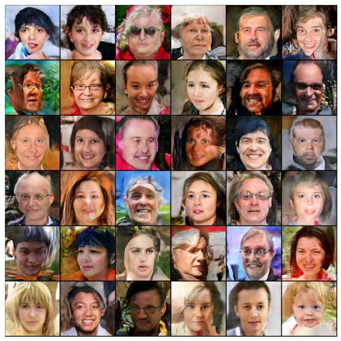

# GAN

В этом проекте я создаю свой GAN и использую датасет [Flickr Faces](https://www.kaggle.com/imcr00z/flickr-faces-70k-thumbnails-128x128) для обучения. 

Мой ган построен на свертках с использованием нескольких трюков для более стабильного обучения. Так, я использую слои нормального шума в дискриминаторе, применяю label smoothing, использую разные learning rate для генератора и дискриминатора, а также StepLR scheduler.  

На 350 эпохах мой ган генерирует такие изображения
 

Также, я измеряю качество сгенерированных изображений с помощью подсчета accuracy (для этого была построена leave-one-out оценка на KNN). Полученное значение accuracy- 0.58. Значит, GAN генерит неплохие изображения. 

Определение архитектур дискриминатора и генератора, их обучение и оценка качества находятся в ноутбуке gan.ipynb
